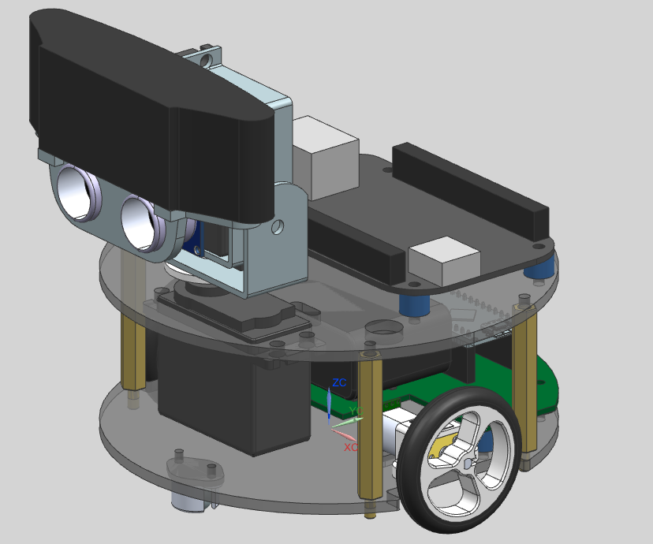

# Robot Moh

## Robot móvil para navegación

Este repositorio contiene los archivos necesarios para poner a funcionar el robot, como:

- Diagrama y PCB en documentos de Eagle
- Archivos de CAD del chasis en formato de Siemens Unigraphics NX 10.5
- Lista de materiales en documento de Excel, y de corte laser del chasis en PDF.
- Codigos, del arduino y de la Raspberry Pi o BeagleBone Black

### Diseño en CAD del robot

---

Diseñado por: **Ing. Gerardo Ramos Vasquez**
